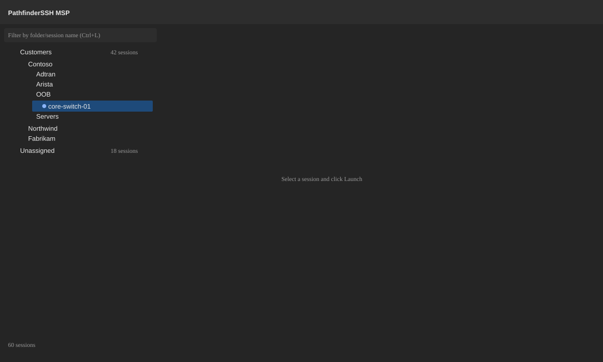
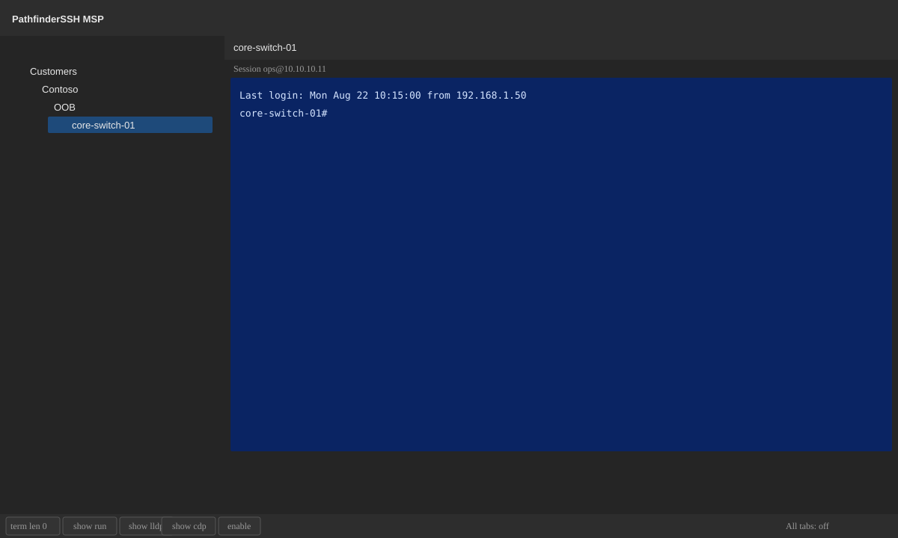
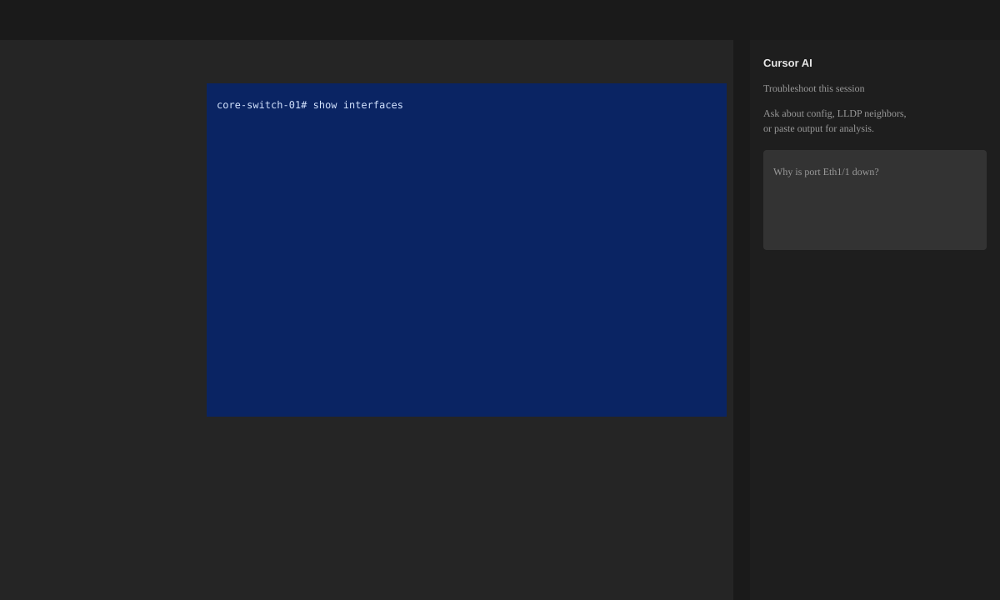

# MSP features — UI tour

Screenshots use **synthetic names only** (Contoso, Northwind, Fabrikam). See [images/README.md](images/README.md).

## Main window

| Area | Purpose |
| --- | --- |
| **Top toolbar** | Connect, Crawl, Capture, Map, Search, Scripts, Tabs, Settings |
| **Left tree** | `Customers/` and `Unassigned/` session inventory |
| **Filter** | Ctrl+L — filter by folder or session name |
| **Footer actions** | Launch, Add session, Add folder, Add user, Edit, Delete |
| **Status** | Total session count; hint when nothing is open |

## Customer tree

- One folder per customer under **Customers**
- Nested folders for site, vendor, or role (e.g. OOB, Servers)
- Integration subfolders: `Auvik/`, `Domotz/`, `Ninja/`, `DattoRMM/`, `Automate/`, `N-central/`
- Leaf nodes are connectable sessions (SSH, telnet, serial)
- **Unassigned** holds imports not yet filed under a customer

Import paths:

- SecureCRT tree → **Customers** on first run
- PSA sync (ConnectWise, Autotask, Halo) or JSON → customer folder names
- Inventory sync → `Customers/<client>/<source>/`
- Vault import → credentials linked across all subfolders under customer
- CSV crawl seeds → [customer-crawl-seeds.example.csv](customer-crawl-seeds.example.csv)

## Active session

| Element | Behavior |
| --- | --- |
| **Tab** | One tab per open session; Ctrl+W closes |
| **Session header** | Shows vault user and target host |
| **Terminal** | Full scrollback, themes, detach to window |
| **Button bar** | YAML macros — `send:` one-liners or `script:` files |
| **All tabs** | Arm macro to every open terminal |

Ops extras: SFTP tab, port forwards, tile layout, evidence pack, script recorder.

## Settings → Tools (MSP integrations)

Visible only with **Microsoft 365 or Google** enrollment. Solo hides the entire integration section.

| Section | Role |
| --- | --- |
| Inventory defaults | Default SSH user + vault credential for all RMM syncs |
| Auvik | Inventory + optional tunnel + periodic sync |
| IT Glue / Hudu / Passportal | Credential vault import |
| ConnectWise / Autotask / Halo | PSA customer sync |
| Domotz / Ninja / Datto / Automate / N-central | Inventory alternatives |

Full field list: [MSP-INTEGRATION-SETTINGS.md](MSP-INTEGRATION-SETTINGS.md)

Combination workflows: [MSP-INTEGRATION-COMBINATIONS.md](MSP-INTEGRATION-COMBINATIONS.md)

## File menu (MSP sync actions)

When cloud MSP sign-in is active, File adds:

| Category | Actions |
| --- | --- |
| **PSA** | Sync ConnectWise / Autotask / Halo customers; import PSA JSON |
| **Inventory** | Auvik import/sync; Domotz, Ninja, Datto RMM, Automate, N-central device sync |
| **Credentials** | IT Glue, Hudu, Passportal vault import + session linking |

Each inventory/vault dialog includes a **customer folder picker** that fuzzy-matches PSA names to existing folders.

## Install wizard

Graphical first-run and `pfinstall.exe -install-gui`:

- **Solo** — local vault only; **no integration UI**
- **Microsoft 365** — Entra OIDC; unlocks full MSP stack
- **Google** — Workspace OIDC; unlocks full MSP stack

See [INSTALL.md](INSTALL.md) and [AUTH.md](AUTH.md).

## Cursor AI pane (optional)

Enable in Settings → Cursor. Troubleshoot modal sends session context to Cloud Agents API. See [CURSOR-AI.md](CURSOR-AI.md).

## Feature matrix

| Feature | Doc |
| --- | --- |
| Integration stack | [MSP-INTEGRATION-STACK.md](MSP-INTEGRATION-STACK.md) |
| All combinations | [MSP-INTEGRATION-COMBINATIONS.md](MSP-INTEGRATION-COMBINATIONS.md) |
| Integration settings | [MSP-INTEGRATION-SETTINGS.md](MSP-INTEGRATION-SETTINGS.md) |
| Install / update | [INSTALL.md](INSTALL.md) |
| Sign-in modes | [AUTH.md](AUTH.md) |
| Auvik | [AUVIK-API.md](AUVIK-API.md) |
| IT Glue | [ITGLUE-API.md](ITGLUE-API.md) |
| Other inventory / vault / PSA | [INTEGRATIONS.md](INTEGRATIONS.md) |
| Day-to-day workflows | [OPERATIONS.md](OPERATIONS.md) |
| Binaries / flags | [CLI.md](CLI.md) |
| Packages / data flow | [ARCHITECTURE.md](ARCHITECTURE.md) |
